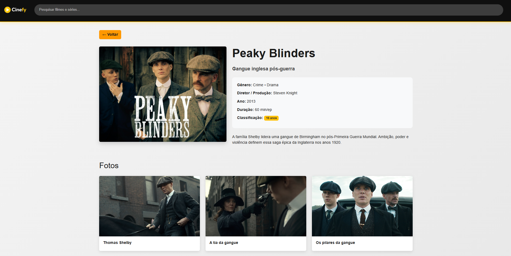

[](https://classroom.github.com/a/449xHS0j)
# Trabalho Prático - Semana 12

Nesta atividade, vamos trabalhar com uma API de mercado para montar uma interface de visualização de filmes. Para isso, vamos utilizar a [The Movie DB API](https://developer.themoviedb.org/docs/getting-started). A página resultante deve listar os resultados de uma requisição HTTP no formato de cards e deve incluir uma funcionalidade de pesquisa ou filtro. 

## Informações Gerais

- Nome: João Paulo de Castro
- Matricula: 908161


## Prints do trabalho

### Prints da Home Page

**Desktop**


---

### Print da Página de Detalhes
**Desktop**



### Dados JSON do arquivo app.js

```json
dados = [
  {
    "id": 1,
    "nome": "Kung Fu Panda",
    "descricao": "Um panda improvável se torna herói",
    "conteudo": "Um panda desajeitado é escolhido para ser o Dragão Guerreiro e deve defender seu vale de um vilão feroz. Uma jornada hilariante de autodescoberta e respeito.",
    "genero": "Animação • Ação",
    "diretor": "Mark Osborne",
    "ano": 2008,
    "duracao": "92 min",
    "classificacao": "Livre",
    "destaque": true,
    "imagem_principal": "img/filmes/kungfu.png",
    "fotos": [
      { "id": 1, "titulo": "Po e sua gangue", "imagem": "img/filmes/kungfu2.png" },
      { "id": 2, "titulo": "O mestre", "imagem": "img/filmes/kungfupanda3.jpg" },
      { "id": 3, "titulo": "O vale", "imagem": "img/filmes/kungfupanda4.jpg" }
    ]
  },
  {
    "id": 2,
    "nome": "O Show de Truman",
    "descricao": "Uma vida transmitida sem saber",
    "conteudo": "Truman é o protagonista involuntário de um reality show contínuo. Gradualmente, ele começa a notar anomalias em seu mundo perfeito e questiona a realidade ao seu redor.",
    "genero": "Drama • Ficção",
    "diretor": "Peter Weir",
    "ano": 1998,
    "duracao": "103 min",
    "classificacao": "12 anos",
    "destaque": true,
    "imagem_principal": "img/filmes/showdetruman.png",
    "fotos": [
      { "id": 1, "titulo": "Saindo do estúdio", "imagem": "img/filmes/showdetruman2.png" },
      { "id": 2, "titulo": "Olhando para câmera", "imagem": "img/filmes/trumanshow3.png" }
    ]
  },
  {
    "id": 3,
    "nome": "Seven: Os 7 Pecados",
    "descricao": "Um serial killer baseado nos pecados",
    "conteudo": "Dois detetives, um veterano e outro novato, caçam um serial killer que mata suas vítimas baseado nos sete pecados capitais. Um thriller psicológico tenso e sombrio.",
    "genero": "Suspense • Crime",
    "diretor": "David Fincher",
    "ano": 1995,
    "duracao": "127 min",
    "classificacao": "14 anos",
    "destaque": true,
    "imagem_principal": "img/filmes/seven.png",
    "fotos": [
      { "id": 1, "titulo": "Brad Pitt", "imagem": "img/filmes/seven.jpg" },
      { "id": 2, "titulo": "Brad Pitt descobrindo", "imagem": "img/filmes/seven3.jpg" },
      { "id": 3, "titulo": "Vilão do filme", "imagem": "img/filmes/seven4.jpg" }
    ]
  },
  {
    "id": 4,
    "nome": "Dexter",
    "descricao": "Um assassino com código moral",
    "conteudo": "Dexter é um analista forense que secretamente é um assassino em série. Ele segue um código moral passado por seu padrasto, perseguindo apenas criminosos perigosos.",
    "genero": "Crime • Drama",
    "diretor": "Showtime",
    "ano": 2006,
    "duracao": "45 min/ep",
    "classificacao": "16 anos",
    "destaque": false,
    "imagem_principal": "img/filmes/dexter3.png",
    "fotos": [
      { "id": 1, "titulo": "Dexter banner", "imagem": "img/filmes/dexter.png" },
      { "id": 2, "titulo": "Dexter e sua irmã Debra", "imagem": "img/filmes/dexter2.png" }
    ]
  },
  {
    "id": 5,
    "nome": "Breaking Bad",
    "descricao": "Professor vira produtor de drogas",
    "conteudo": "Um professor de química desempregado se torna produtor de metanfetamina para garantir o futuro financeiro de sua família. Uma transformação épica do bem ao mal.",
    "genero": "Drama • Crime",
    "diretor": "Vince Gilligan",
    "ano": 2008,
    "duracao": "47 min/ep",
    "classificacao": "16 anos",
    "destaque": true,
    "imagem_principal": "img/filmes/bb.png",
    "fotos": [
      { "id": 1, "titulo": "Pinkman drogado", "imagem": "img/filmes/bb2.png" },
      { "id": 2, "titulo": "Walter White e Pinkman", "imagem": "img/filmes/bb3.png" },
      { "id": 3, "titulo": "No deserto", "imagem": "img/filmes/bb4.jpg" }
    ]
  },
  {
    "id": 6,
    "nome": "Peaky Blinders",
    "descricao": "Gangue inglesa pós-guerra",
    "conteudo": "A família Shelby lidera uma gangue de Birmingham no pós-Primeira Guerra Mundial. Ambição, poder e violência definem essa saga épica da Inglaterra nos anos 1920.",
    "genero": "Crime • Drama",
    "diretor": "Steven Knight",
    "ano": 2013,
    "duracao": "60 min/ep",
    "classificacao": "16 anos",
    "destaque": false,
    "imagem_principal": "img/filmes/pb.jpg",
    "fotos": [
      { "id": 1, "titulo": "Thomas Shelby", "imagem": "img/filmes/pb2.jpg" },
      { "id": 2, "titulo": "A tia da gangue", "imagem": "img/filmes/pb3.jpg" },
      { "id": 3, "titulo": "Os pilares da gangue", "imagem": "img/filmes/pb4.jpg" }
    ]
  }
];
```

